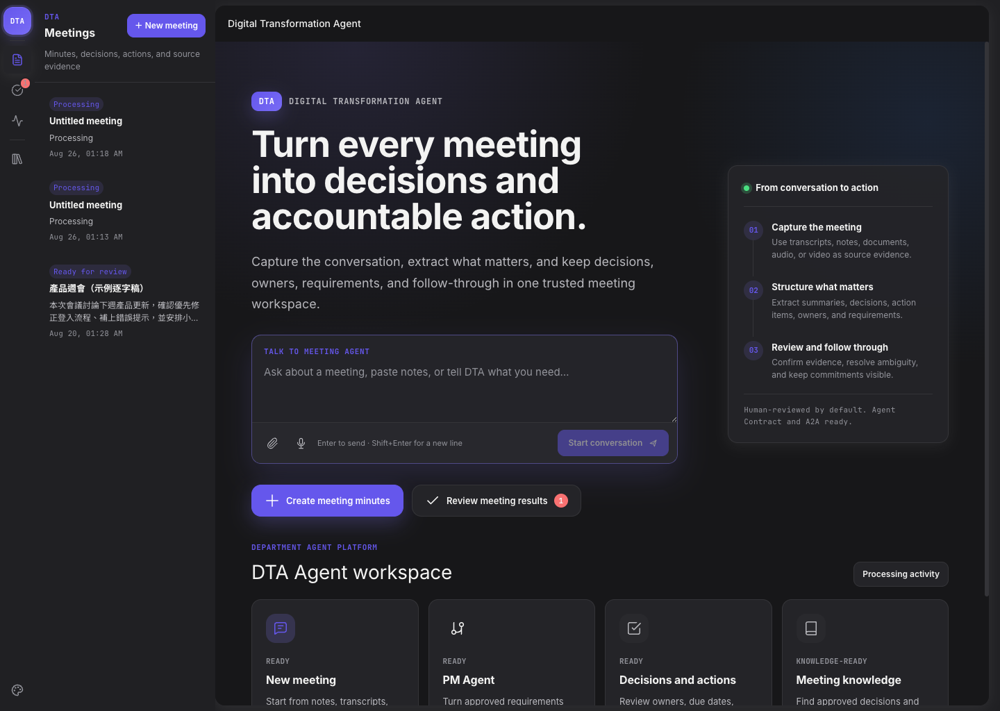

# Digital Transformation Agent

<p align="center">
  <a href="README.md">English</a> |
  <a href="README.zh-TW.md">繁體中文</a> |
  <a href="README.ja.md"><strong>日本語</strong></a> |
  <a href="README.de.md">Deutsch</a>
</p>

**DTA は、会話やファイルをレビュー可能で追跡可能な成果へ変換する、Meeting-first の部門向け Agent プラットフォームです。**

同じ server-side Agent コアを Web、TUI、CLI、REST、A2A から利用できます。Meeting Agent が会議内容を整理し、PM Agent が承認済み要件を製品ドキュメントと開発タスクへ引き継ぎます。会社の Orchestrator は、内部の Pi runtime を意識せず、安定した Agent contract を呼び出せます。

> このページは概要版です。完全な導入・運用手順は [English README](./README.md) または [繁體中文 README](./README.zh-TW.md) を参照してください。

<p align="center">
  
</p>

## 主な機能

| Agent / entry point | 機能 |
|---|---|
| **Meeting Agent** | transcript、TXT、Markdown、DOCX、audio、video から summary、decisions、action items、requirements を生成 |
| **PM Agent** | 要件から URD、PRD、user stories、acceptance criteria、design context、task plan を生成 |
| **Web / TUI / CLI** | 同じ Agent core をブラウザまたはターミナルから操作 |
| **REST / A2A 1.0** | 会社の Orchestrator から Agent run を作成・追跡 |
| **Adapters** | local filesystem、MinIO、Keycloak、n8n、speech-to-text、vision を設定で切り替え |

Meeting の結果は単なる Markdown ではなく、構造化された run、artifact、action として保存されます。下流処理は既定で human review を必要とします。

## ソースから起動

必要環境: Node.js 22+、npm、Git。グローバル Pi CLI は不要です。

```bash
git clone https://github.com/yhwangtw/dta.git
cd dta
cp .env.example .env.local
npm ci
npm run dev
```

ブラウザで `http://localhost:30141` を開きます。

```bash
# CLI
npm run dta -- run meeting --task "この transcript を整理してください" --transcript ./meeting.txt
npm run dta -- run pm --task "この要件から PRD と task plan を作成してください"

# Interactive TUI
npm run tui -- meeting
```

`setup.sh` は end-user 向け production installer です。同期前にローカル変更の private backup を作成し、対話的な確認を要求します。開発 checkout では使用せず、オフライン時は `DTA_SETUP_OFFLINE=1 bash setup.sh` を使用してください。

## 選択可能な Coding Workspace

DTA は Pi Web shell の既存機能を保持しています。ローカル／開発者モードでは、Pi session、SSE streaming、files、git diff、snapshot、schedules、tGD artifacts、MCP、Plan Mode、structured output、Safety Guard、embedded subagents を利用できます。会社モードでは、指定された coding role を持つユーザーにのみ表示されます。

Safety Guard は高影響操作を確認しますが、OS sandbox ではありません。Coding Agent を有効にする場合は、専用 OS user、container または VM と、最小限の workspace mount を使用してください。

## Docker と Helm

公開済み artifacts:

```text
Docker image: yhwangtn/dta
OCI Helm chart: oci://registry-1.docker.io/yhwangtn/dta-agent-platform
```

```bash
docker pull yhwangtn/dta:vYYYY.MM.DD
docker run --rm -p 30141:30141 \
  -e DTA_AUTH_MODE=none \
  -e DTA_ARTIFACT_STORE=local \
  -e DTA_MEMORY_STORE=local \
  -e DTA_WORKFLOW_PROVIDER=none \
  -v dta-data:/data \
  yhwangtn/dta:vYYYY.MM.DD
```

会社環境では、chart version と image digest を別々に固定し、`replicaCount: 1` を維持してください。詳細は [Deployment guide](./docs/deployment.md) と [Helm documentation](./deploy/helm/dta-agent-platform/README.md) を参照してください。

## External contracts

```text
POST /api/agents/meeting/run
POST /api/agents/pm/run
GET  /api/agent-runs/{runId}
GET  /api/agent-runs/{runId}/events

GET  /.well-known/agent-card.json
POST /a2a/v1/message:send
POST /a2a/v1/message:stream
```

Pi 固有の session や event は外部 API に公開しません。

## Production での重要な制約

- Pi session runtime と active run supervision は process-local のため、現時点では `replicas: 1` が必須です。
- Browser login は Keycloak 対応 ingress/proxy で行い、DTA は token と ownership を検証します。
- audio/video 処理には外部 speech-to-text provider が必要です。画面理解には任意の vision provider が必要です。
- n8n workflow は human review、scope、idempotency を確認してから有効化してください。
- 本番投入前に `dta pilot-check --live` で identity、storage、workflow、media 経路を検証してください。

## 詳細ドキュメント

- [Architecture](./docs/architecture.md)
- [Deployment](./docs/deployment.md)
- [Company pilot readiness](./docs/company-pilot-readiness.md)
- [Meeting media pipeline](./docs/meeting-media-pipeline.md)
- [n8n integration](./docs/n8n.md)

## License

MIT — see [LICENSE](./LICENSE).
