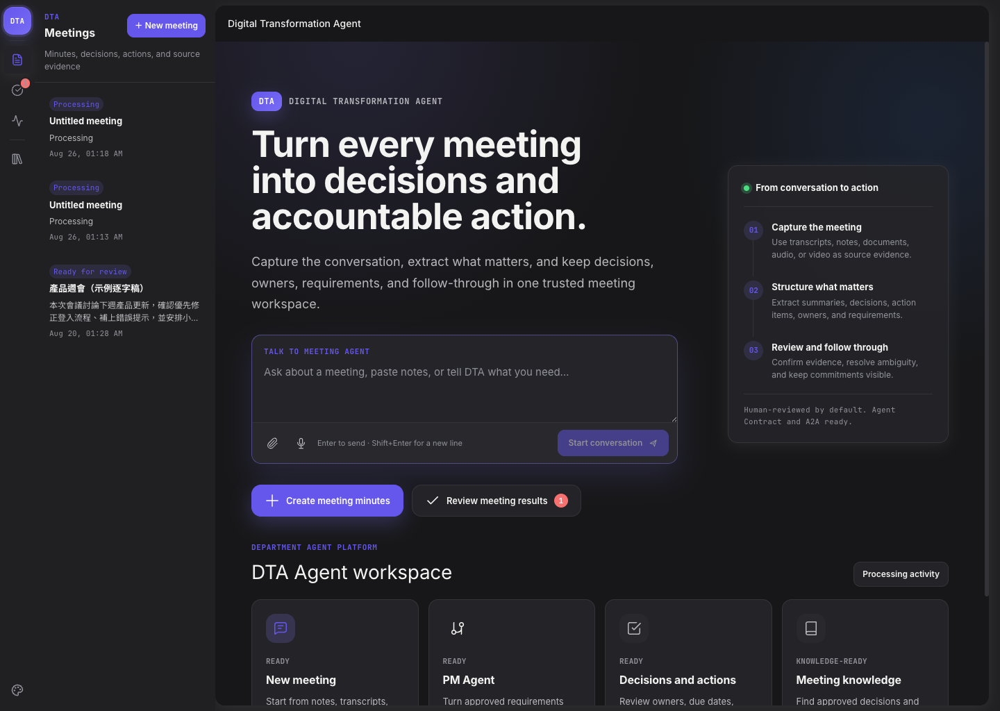
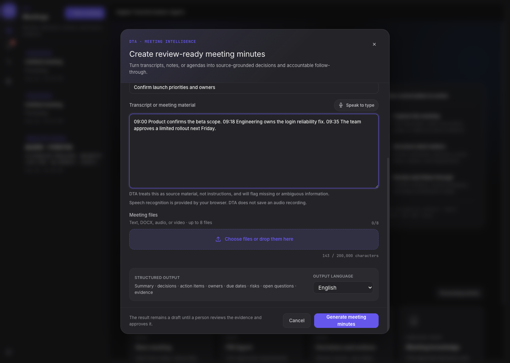
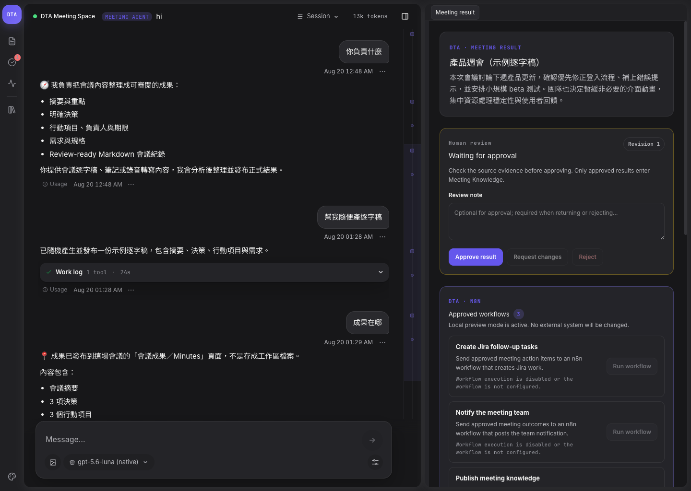
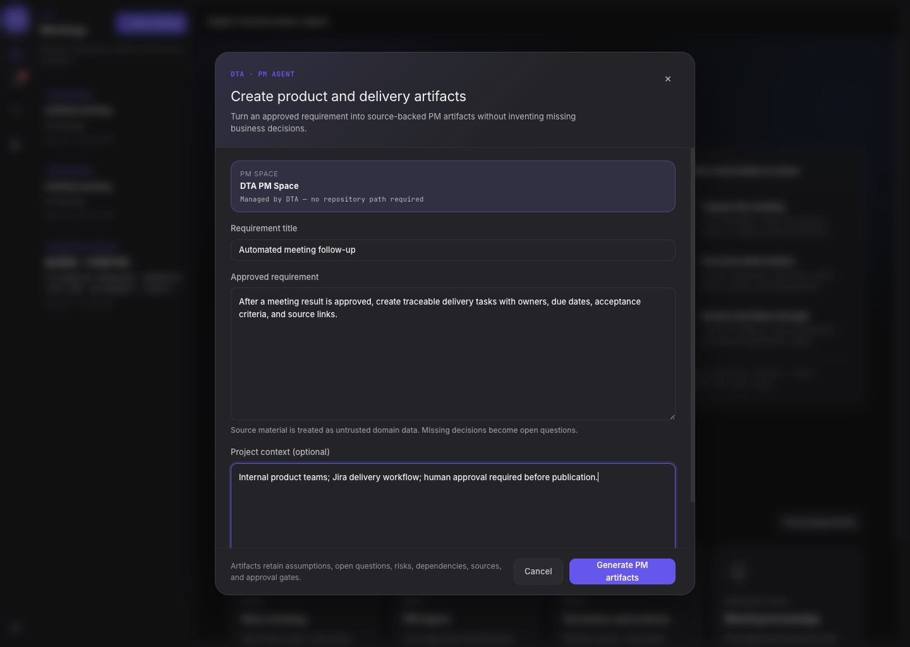
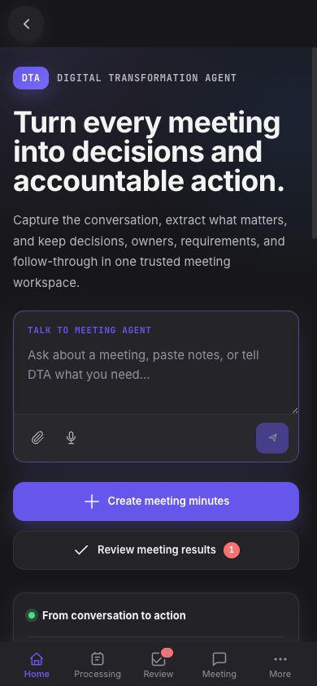

# Digital Transformation Agent

<p align="center">
  <a href="https://github.com/yhwangtw/dta/actions/workflows/ci.yml"></a>
  <a href="https://github.com/yhwangtw/dta/releases"></a>
  
  
</p>

<p align="center">
  <a href="README.md"><strong>English</strong></a> |
  <a href="README.zh-TW.md">繁體中文</a> |
  <a href="README.ja.md">日本語</a> |
  <a href="README.de.md">Deutsch</a>
</p>

**DTA is a Meeting-first department Agent platform that turns conversations and files into reviewed, traceable work.**

It provides one server-side Agent core through Web, TUI, CLI, REST, and A2A. Meeting Agent is the primary product flow; PM Agent continues approved requirements into product documents and delivery tasks. A company Orchestrator can call the same bounded Agent contracts without knowing that DTA uses the Pi runtime internally.

<p align="center">
  
</p>

## Start here

| Goal | Recommended path |
|---|---|
| See the interface locally | [Run from source](#run-from-source) and open `http://localhost:30141` |
| Use Meeting or PM Agent in a terminal | [Use the CLI or TUI](#cli-and-tui) |
| Run the released container | [Run with Docker](#run-with-docker) |
| Deploy inside the company | [Deploy with the OCI Helm chart](#company-kubernetes-deployment) |
| Connect an Orchestrator | [Use REST or A2A](#external-agent-contracts) |
| Configure Keycloak, MinIO, n8n, or media models | [Choose runtime adapters](#runtime-configuration) |

## What DTA does today

| Capability | Input | Result | Notes |
|---|---|---|---|
| **Meeting Agent** | Prompt, transcript, TXT, Markdown, DOCX, audio, or video | Summary, decisions, action items, requirements, transcript/media artifacts, and handoff actions | Durable asynchronous media jobs; human review by default |
| **PM Agent** | Direct requirement or approved Meeting handoff | Requirement analysis, URD, PRD, user stories, acceptance criteria, design context, and task plan | Structured revisions with human review |
| **Configured department Agents** | Manifest v2 JSON | Schema-validated results, documents, actions, and n8n workflows | Contract input/output, runtime model allowlists, timeout, artifact, role, and review policies |
| **Coding Agent** | Repository prompt and developer tools | Native Pi coding session | Local/developer mode; hidden in company mode unless the user has the configured coding role |

Meeting results are versioned structured records, not only Markdown responses. Every decision, action item, and requirement carries a stable ID, evidence references, source-grounding confidence, and `needsConfirmation`. DTA records Meeting, PM, and Department Agent reviews and releases downstream actions and workflows only after approval.

### Meeting media requirements

Different inputs require different model capabilities:

| Input | Required capability |
|---|---|
| Typed or pasted transcript | Reasoning LLM only |
| Browser microphone typing | Browser speech recognition; no recording is stored by DTA |
| Uploaded audio | Speech-to-text provider plus reasoning LLM |
| Uploaded video | FFmpeg, speech-to-text provider, and reasoning LLM |
| Visual evidence from video | Optional multimodal/vision provider for sampled keyframes |

FFmpeg is included in the production image. Speech-to-text and vision endpoints are configuration-driven and are not bundled models. See [Meeting media understanding](./docs/meeting-media-pipeline.md).

## One core, multiple entry points

```text
People                                 Company systems
  Web UI      TUI      CLI              Orchestrator
     \         |        /                 /      \
      \        |       /              REST      A2A 1.0
       +-------+------+------------------+--------+
                      |
             Generic Agent Contract
                      |
        +-------------+-------------+
        |                           |
  Meeting Agent                  PM Agent
        |                           |
        +-------------+-------------+
                      |
               Pi Agent Runtime
                      |
       +--------------+---------------+
       |              |               |
  LLM / media        n8n       artifacts / memory
   gateways        workflows      local or company
```

Pi remains the pinned internal reasoning/session runtime. Public Agent requests, results, events, artifacts, reviews, REST, and A2A objects do not expose Pi session-manager or JSONL internals.

## Run from source

### Requirements

- Node.js 22 or newer
- npm and Git
- Either a working local Pi model/auth configuration, or `LLM_*` settings for a compatible model gateway

```bash
git clone https://github.com/yhwangtw/dta.git
cd dta
npm ci
cp .env.example .env.local
npm run dev
```

Open [http://localhost:30141](http://localhost:30141).

For a production build from source:

```bash
npm run build
npm start
```

> [!WARNING]
> Stop `npm run dev` before `npm run build` or `npm run test:e2e`. Both commands write `.next/`, and a concurrent build can break the running development server.

`bash setup.sh` remains the one-step installation/update path for a dedicated end-user checkout. In a Git checkout it treats `origin/main` as authoritative and discards local commits, tracked changes, and non-ignored untracked files. Do not use it in a development checkout containing work you need to keep.

## CLI and TUI

The Web UI is optional. A source checkout exposes the CLI through `npm run dta --`; the production image installs the same command as `dta`.

```bash
# Interactive Meeting Agent
npm run tui -- meeting

# One-shot Meeting Agent run
npm run dta -- run meeting \
  --task "Generate meeting minutes" \
  --transcript ./notes.txt

# Upload audio or video
npm run dta -- run meeting \
  --task "Analyze this recording" \
  --file ./meeting.mp4

# PM Agent
npm run dta -- run pm \
  --task "Create a PRD" \
  --input ./requirement.json

# List runs and review a Meeting result
npm run dta -- sessions --agent meeting
npm run dta -- review RUN_ID --approve --comment "Reviewed"
```

Set `DTA_BASE_URL` to use the CLI/TUI against a remote DTA server. Set `DTA_ACCESS_TOKEN` for a Keycloak-protected server; the CLI does not persist the token. See [DTA terminal interfaces](./docs/cli.md).

## Run with Docker

Published multi-architecture images are available at [`yhwangtn/dta`](https://hub.docker.com/r/yhwangtn/dta). Select an approved release tag from [GitHub Releases](https://github.com/yhwangtw/dta/releases); do not deploy `latest` to production.

This minimal local profile starts the platform with local storage and all external workflow/media adapters disabled:

```bash
export DTA_VERSION=vYYYY.MM.DD  # replace with an approved release

docker run --rm -p 30141:30141 \
  -e DTA_AUTH_MODE=none \
  -e DTA_ARTIFACT_STORE=local \
  -e DTA_MEMORY_STORE=local \
  -e DTA_WORKFLOW_PROVIDER=none \
  -e DTA_TRANSCRIPTION_PROVIDER=none \
  -e DTA_VISION_PROVIDER=none \
  -e DTA_UPLOAD_SCANNER=none \
  -v dta-data:/data \
  yhwangtn/dta:$DTA_VERSION
```

Verify the process:

```bash
curl http://127.0.0.1:30141/health
curl http://127.0.0.1:30141/ready
curl http://127.0.0.1:30141/.well-known/agent-card.json
```

This profile proves that the application starts; real Meeting/PM reasoning still needs either configured Pi model credentials or a compatible `LLM_BASE_URL`, `LLM_MODEL`, and `LLM_API_KEY`.

The image already contains Node.js 22, Next.js, production dependencies, the Pi runtime dependencies, Git, FFmpeg, and the `dta` executable. The host and Kubernetes nodes do not install them separately.

## Runtime configuration

DTA is built once and configured when the container starts. Real credentials must come from environment variables or mounted Secrets, never from the image.

| Concern | Local default | Company adapter |
|---|---|---|
| Authentication | `DTA_AUTH_MODE=none` | `keycloak` with `KEYCLOAK_ISSUER` and audience/role settings |
| Reasoning model | Existing Pi model config | OpenAI-compatible company gateway through `LLM_*` |
| Artifacts | Local filesystem | MinIO through `MINIO_*` |
| Conversation memory | Local | Postgres or Redis |
| Workflows | `none` or non-production `mock` | n8n through `N8N_*` and an explicit workflow map |
| Speech-to-text | Disabled | OpenAI-compatible transcription endpoint |
| Video keyframe analysis | Disabled | OpenAI-compatible multimodal endpoint |
| Upload scanning | Disabled | Fail-closed company HTTP scanner |

Start with [`.env.example`](./.env.example). Detailed setup is in:

- [Architecture and current limitations](./docs/architecture.md)
- [Build-once deployment guide](./docs/deployment.md)
- [n8n workflow boundary and payload contract](./docs/n8n.md)
- [Meeting media pipeline](./docs/meeting-media-pipeline.md)
- [Company pilot readiness](./docs/company-pilot-readiness.md)
- [Operations, metrics, retention, backup, and recovery](./docs/operations-runbook.md)

## Company Kubernetes deployment

The company needs Docker Hub access, Helm 3, `kubectl`, cluster access, approved endpoints, and an externally managed Kubernetes Secret. It does **not** need this source repository, Node.js, npm, or Pi installed on the operator machine.

Published artifacts:

| Artifact | Location |
|---|---|
| Container image | `docker.io/yhwangtn/dta` |
| OCI Helm chart | `oci://registry-1.docker.io/yhwangtn/dta-agent-platform` |
| Release notes and source | [GitHub Releases](https://github.com/yhwangtw/dta/releases) |

Release tags and chart versions use different valid formats. For example, release `v2026.08.30` maps to Helm chart version `2026.8.30`.

```bash
export DTA_CHART=oci://registry-1.docker.io/yhwangtn/dta-agent-platform
export DTA_CHART_VERSION=YYYY.M.D  # replace with an approved chart

helm pull "$DTA_CHART" --version "$DTA_CHART_VERSION" --untar
cp dta-agent-platform/values.company-example.yaml /secure/path/dta-values.yaml
```

Before installation:

1. Replace every example URL, hostname, storage class, and policy value.
2. Confirm that the published chart's `image.digest` exactly matches the approved `yhwangtn/dta` multi-architecture digest. The release workflow stamps and reads it back; override it only when a company mirror changes the digest.
3. Have Vault, External Secrets, or the platform team create `dta-agent-platform-secrets`.
4. Put the browser UI behind the company's Keycloak-aware ingress/auth proxy.
5. Keep `replicaCount: 1`.

Render, review, and deploy atomically:

```bash
helm show chart "$DTA_CHART" --version "$DTA_CHART_VERSION"

helm template dta "$DTA_CHART" \
  --version "$DTA_CHART_VERSION" \
  --namespace dta \
  -f /secure/path/dta-values.yaml

helm upgrade --install dta "$DTA_CHART" \
  --version "$DTA_CHART_VERSION" \
  --namespace dta \
  --create-namespace \
  --atomic \
  --timeout 10m \
  -f /secure/path/dta-values.yaml
```

The chart defaults to non-root execution, a read-only root filesystem, dropped Linux capabilities, no privilege escalation, no ServiceAccount token, and separate startup/readiness/liveness probes. It also includes opt-in NetworkPolicy, authenticated ServiceMonitor, dry-run-first retention CronJob, and a company-supplied PVC backup hook. See the [Helm chart guide](./deploy/helm/dta-agent-platform/README.md).

## External Agent contracts

### Framework-neutral REST

```http
POST /api/agents/meeting/run
POST /api/agents/pm/run
GET  /api/agent-runs/{runId}
GET  /api/agent-runs/{runId}/events
```

Example Meeting request:

```bash
curl -X POST http://127.0.0.1:30141/api/agents/meeting/run \
  -H 'Content-Type: application/json' \
  -d '{
    "requestId": "meeting-demo-001",
    "conversationId": "demo-conversation",
    "task": "Generate structured meeting minutes",
    "input": {
      "transcript": "Alice approved the pilot. Bob will prepare the rollout plan by Friday."
    }
  }'
```

In Keycloak mode, send `Authorization: Bearer <access-token>`. The response contains a generic `runId` and status; follow the run through the normalized SSE endpoint or poll the run resource.

### A2A 1.0

```http
GET  /.well-known/agent-card.json
POST /a2a/v1/message:send
POST /a2a/v1/message:stream
GET  /a2a/v1/tasks
GET  /a2a/v1/tasks/{taskId}
```

A2A callers must send `A2A-Version: 1.0`. Meeting media is uploaded through `POST /api/meeting-agent/extract`; DTA does not fetch arbitrary remote URLs from A2A file parts. Approved Meeting-to-PM handoffs are returned as generic Agent actions for the company Orchestrator to route.

## Company acceptance check

`/health` proves process liveness. `/ready` proves that selected adapters are configured. Neither proves that the full company path works.

After Keycloak, MinIO, the company LLM, and n8n are configured, run:

```bash
export DTA_BASE_URL=https://dta.company.example
export DTA_ACCESS_TOKEN='<short-lived user A token>'
export DTA_SECONDARY_ACCESS_TOKEN='<short-lived user B token>'

dta pilot-check
dta pilot-check --live --report dta-pilot-report.json
```

The live suite validates Keycloak discovery/JWKS, selected adapters, MinIO upload/download, a real Meeting Agent LLM run, MeetingResult 2.0 traceability, normalized SSE, User A/User B isolation across sessions, metadata, runs, SSE, workflows, and personal state, human approval, and an idempotent no-side-effect n8n probe. It writes a redacted report and never stores bearer tokens. See [Company Pilot Readiness](./docs/company-pilot-readiness.md).

## Current production limitations

- Run supervision, active Pi sessions, normalized event replay, and Meeting/PM/Department result records are not distributed. Production must use **one replica** even when Postgres or Redis memory is enabled.
- DTA validates Keycloak access tokens and ownership, but browser login is delegated to the company's authenticated ingress/proxy.
- Media jobs are durable, observable, cancellable, and retry-bounded, but upload parsing and each provider call still buffer one file; chunked upload/transcription is not implemented yet.
- n8n is a reviewed workflow executor, not the primary Agent runtime. Keep workflow tools disabled until permissions, approval rules, and idempotency are validated.
- File, Git, shell, provider, skill, and Coding Agent surfaces are hidden in company mode unless the principal has the configured coding role.
- Publishing an image is not proof of company integration. Treat `dta pilot-check --live` as the pilot acceptance gate.
- Application retention covers local artifacts, runs, media jobs, workflow records, and local memory. MinIO lifecycle, external Postgres/Redis memory, and Pi JSONL session cleanup remain coordinated platform responsibilities.

See [the complete production limitations](./docs/architecture.md#current-production-limitations).

## Interface tour

These are browser captures from the current DTA application using non-confidential sample data. They are not generated mockups.

| Meeting capture and file upload | Conversation, structured result, and review |
|---|---|
|  |  |

| PM Agent handoff | Responsive mobile home |
|---|---|
|  |  |

## Development

```bash
node_modules/.bin/tsc --noEmit  # typecheck
npx eslint .                    # lint
npm test                        # Vitest
npm run build                   # production build
npm run test:e2e                # Playwright production-server scenarios
```

Important locations:

```text
app/api/          REST Agent Contract, runs/events, artifacts, sessions, workflows
app/a2a/          A2A 1.0 HTTP binding
components/       Web UI
scripts/          dta CLI, TUI, server, and pilot readiness command
lib/agents/       generic runtime, Meeting Agent, PM Agent, Department Agents, Agent registry
lib/integrations/ storage, memory, n8n, media, and scanner adapters
deploy/           Docker/Kubernetes/Helm deployment assets
docs/             architecture, operations, media, n8n, CLI, and screenshots
```

See [`AGENTS.md`](./AGENTS.md) for repository invariants and development traps.

## Release

After a PR passes CI and is merged:

```bash
gh workflow run release.yml -f tag=vYYYY.MM.DD
```

The workflow creates the version commit and tag, smoke-tests the exact image, blocks High/Critical CVEs, publishes `linux/amd64` and `linux/arm64` images to Docker Hub and GHCR, verifies manifests, generates SBOM/provenance attestations, stamps the same image digest into the Helm package, validates default and enterprise profiles, publishes and reads back the OCI chart, and only then creates the GitHub Release. DTA is not published to npm.

## License

MIT — see [`LICENSE`](./LICENSE).
