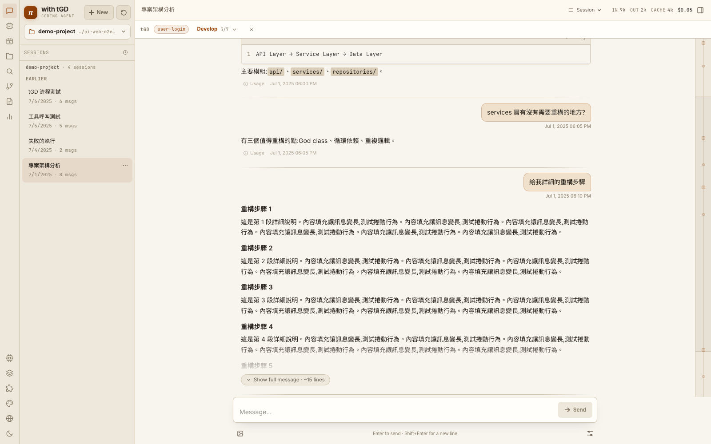

# Pi with tGD — Web Interface

[繁體中文](./README.zh-TW.md) · [Report Bug](https://github.com/openclawyhwang-hub/tGD-pi-web/issues) · [Request Feature](https://github.com/openclawyhwang-hub/tGD-pi-web/issues)

A browser interface for the [Pi Coding Agent](https://github.com/earendil-works/pi). Browse conversations, chat with the agent in real time, run shell commands, review what the agent changed, fork threads, and switch between message branches — without leaving the browser.

> **Why a web UI?** Pi's terminal is great for heads-down coding. This project adds what a terminal can't easily give you: a visual session browser, live streaming with honest status, a file tree with git-aware diffs, in-place file editing, command palette, and five switchable skins — so you can observe, steer, and review long-running agent work at a glance.



---

## Quick Start

**For users** — run the prebuilt package (no clone, no build):

```bash
npx @agegr/pi-web
```

The server starts on [http://localhost:30141](http://localhost:30141) and opens your browser. Custom port: `npx @agegr/pi-web -p 8080`.

**For development** — clone and run from source:

```bash
git clone https://github.com/openclawyhwang-hub/tGD-pi-web.git
cd tGD-pi-web
./setup.sh        # checks Node/npm, installs deps, verifies Pi Agent is present
# … or the manual equivalent:
npm install && npm run dev
```

`setup.sh` is a guided bootstrap: it checks Node ≥ 18, installs dependencies if `node_modules/` is missing, confirms `~/.pi/agent/` exists, and offers to launch the dev server. It does **not** mutate anything outside this repo.

Requirements: Node.js ≥ 22 and a working [pi](https://github.com/earendil-works/pi) setup (`~/.pi/agent/`).

---

## Highlights

A few things this interface does that the terminal alone doesn't:

- **Honest status** — live spinner + elapsed timer while running, stall warning when the model goes quiet, full error card (never a silent empty reply) with one-click **Retry** that rolls back and re-sends the same prompt.
- **Two ways to branch** — **Fork** any user message into an independent new session, or use **in-session branches** to roll back to any node and continue; a branch navigator in the top bar shows siblings.
- **Tool-call diff view** — `edit` calls expand into a real red/green diff; `write` calls show the file content. No more reading raw JSON arguments.
- **Deep file search + git-aware tree** — typing 2+ chars searches the whole project (server-side, junk dirs skipped); modified/untracked files carry M/A/D/U badges.
- **Five skins, light + dark each** — Editorial (warm paper, default), Terminal (emerald), Industrial (mono), Aurora (violet), Glass (frosted panels over an aurora gradient).

<details>
<summary><strong>Full feature list</strong></summary>

### Chat
- **Live streaming** — SSE streaming, tokens appear as they're generated
- **Steer / Follow-up** — Interrupt a running agent, or queue a message for after completion (queued follow-ups are visible and cancellable)
- **Bash mode** — Type `!cmd` to run a shell command directly in the session cwd with streamed output; the result is recorded so the agent sees it. `!!cmd` keeps it out of the LLM context
- **Model switching** — Change model and thinking level mid-conversation
- **Tool panel** — Control which tools the agent can use (none / preset / all)
- **Compact session** — Summarize long threads to save context window
- **Context pressure nudge** — At 80%+ context usage a banner suggests compaction with a one-click Compact button
- **Queue control** — Queued follow-ups are listed individually and can be cancelled one at a time (or all at once)
- **Tool-call diff view** — `edit` tool calls expand into a real red/green diff and `write` calls show the written file content, instead of raw JSON arguments
- **Message bookmarks** — Star any message (hover → ☆); bookmarks persist per session and show as amber markers on the minimap

### Stay informed while it works
- **Tab title** — `⏳ session` while running, flashes `✅` on completion (`⚠` on failure)
- **Browser notification** — When the agent finishes and the tab is in the background
- **Completion sound** — Optional, skipped on failure

### Navigation
- **⌘K command palette** — Search sessions, tags, files, and run commands (bilingual search)
- **⌘F in-conversation find** — Match counter, Enter/⇧Enter to cycle, flash highlight; jumping into a collapsed message expands it
- **⌥↑ / ⌥↓ turn navigation** — Walk between user messages turn by turn; the minimap also jumps on click
- **Long-message collapse** — Historical messages taller than a screen clamp to a preview with a "Show full message" control; the latest exchange always renders in full
- **Icon rail** — Sessions / Files / Changes / Search / Analytics views; Models / Skills / Language / Theme at the bottom
- **Jump to bottom** — Floating button when scrolled up; while output streams it counts the new lines accumulating below (`↓ +N lines`); entering the tail engages sticky follow
- **Always-follow mode** — ⌘K → "Toggle Always-Follow Output" pins the view to streaming output terminal-style (persisted, default off)
- **Input history** — ↑ in an empty input recalls previous messages

### Session Management
- **Session browser** — Grouped by working directory, auto-detects recent projects
- **Project picker** — Search projects, pin favorites, remove stale entries; browse the filesystem with breadcrumbs, or type a path with live autocomplete (Tab completes)
- **Time grouping** — Today / Yesterday / This Week / Earlier
- **Search, tags, pins** — Instant filter, colored tag chips, pinned sessions float to top
- **Archive** — Hide finished sessions from the list without deleting them (right-click → Archive); an "Show archived (N)" toggle reveals them and Unarchive restores
- **Auto-naming** — Generates a title after the first exchange
- **Fork** — Branch off from any user message into an independent new session
- **In-session branches** — Roll back to any node and continue; branch navigator in the top bar
- **Export** — Standalone HTML or plain Markdown
- **Analytics** — Token usage and cost report

### Files & Changes
- **Files view** — Full-height file tree in the rail panel; a collapsible tree also lives under the session list (your choice persists)
- **Deep file search** — Typing 2+ characters in the tree filter searches the whole project recursively (server-side, junk dirs skipped) and shows flat results; clicking a folder result reveals it in the tree
- **Git-aware tree** — Modified/untracked files carry M/A/D/U badges; folders containing changes get a dot; right-click → view diff
- **Context menu & keyboard** — Copy path / relative path / @ mention / view diff on right-click; navigate the tree with ↑ ↓ ← → and Enter
- **Changes view** — Git working-tree status for the session cwd (branch, per-file status + stats), refreshed after every agent turn; click a file for a HEAD ↔ worktree diff
- **File preview** — Source with highlighting, Markdown/HTML preview, images, diffs
- **Resizable panel** — Drag the file panel's left edge to resize (persisted); double-click resets
- **In-file find & go-to-line** — `find / :line` box in the viewer toolbar; matches highlight and center
- **Edit in place** — Text files open in an editor with Save (⌘S) / Cancel; writes go through the same allowed-roots gate as reads
- **@-mention** — Insert a file path into the chat input from the tree

### Rendering
- **Markdown** — GFM, tables, task lists; KaTeX math; Mermaid diagrams
- **Code** — Syntax highlighting + line numbers (highlighter loads lazily off the critical bundle)
- **Provider icons** — Anthropic, OpenAI, Google, etc.

### Appearance
- **Five switchable skins** — Editorial (warm paper, default) / Terminal (emerald) / Industrial (mono) / Aurora (violet) / Glass (frosted panels over an aurora gradient), each with light + dark themes
- **Appearance picker** — palette button in the rail opens a panel with light/dark toggle and swatch cards for every skin (live preview on click); also reachable via ⌘K
- **Frosted floating chrome** — the command palette, dialogs, toasts, find bar, and jump button use backdrop-blur glass matched to every skin's palette
- **Interface language** — English (default) ⇄ Traditional Chinese, globe button in the rail
- **Typography** — Bundled Inter + JetBrains Mono, Traditional-Chinese-first fallback chain, zero network dependency

</details>

### Screenshots

<details>
<summary><strong>View all — command palette, dark mode, file panel & every skin</strong></summary>

**Working views**

| Chat with file panel | Command palette (⌘K) |
|---|---|
|  |  |

| Dark mode | Empty state (no session) |
|---|---|
|  |  |

**All five skins (light theme)**

| Editorial (default) | Terminal | Aurora |
|---|---|---|
|  |  |  |

| Industrial | Glass | |
|---|---|---|
|  |  | |

</details>

---

## Keyboard Shortcuts

| Keys | Action |
|------|--------|
| `⌘K` | Command palette (search & commands) |
| `⌘F` | Find in conversation |
| `⌥↑` / `⌥↓` | Previous / next user message |
| `⇧⌘M` | Models |
| `⌘/` | Skills |
| `⌘B` | Toggle panel |
| `⌘\` | Toggle file panel |
| `↑` | Recall previous message (empty input) |
| `Esc` | Close dialogs |

---

## Configuration

| Item | Description |
|------|-------------|
| Session directory | Defaults to `~/.pi/agent/sessions/`; set `PI_CODING_AGENT_DIR` to override |
| Model config | Reads `models.json`; editable via the Models panel (supports custom baseUrl — point it at an internal gateway or local model for offline networks) |
| API keys | Per-provider keys stored in `auth.json` |
| Default directory | Set or customize via the CWD picker |

---

## Offline / air-gapped deployment

The app itself makes **zero external requests at runtime** (fonts bundled, no CDNs). Only the LLM endpoint needs to be reachable — point `models.json` at an internal gateway or a local model.

- **Internal npm registry (Nexus etc.)**: build once (`npm ci && npm run build`), `npm publish --registry=<internal>`; users run `npx @agegr/pi-web` with their registry pointed internally
- **Portable folder**: on a networked machine of the *same OS/arch*, `npm ci && npm run build`, copy the whole folder, run `npm run start`

---

## Development

```bash
npm install
npm run dev    # port 30141
```

**Verification commands:**

```bash
node_modules/.bin/tsc --noEmit     # Typecheck
npx eslint .                       # Lint
npm test                           # Unit tests (vitest)
```

> ⚠️ **Never** run `next build` while the dev server is running — it pollutes `.next/` and breaks `npm run dev`.

---

## Tech Stack

| Layer | Technology |
|-------|------------|
| Framework | Next.js 16 (App Router) |
| UI | React 19 + CSS variables (design tokens; four skins are token-override blocks) |
| Agent SDK | @earendil-works/pi-ai + pi-coding-agent |
| Markdown | react-markdown + remark-gfm + rehype-katex |
| Diagrams | Mermaid (lazy-loaded) |
| Code | react-syntax-highlighter (PrismAsync, lazy chunk) |
| Fonts | Inter + JetBrains Mono (bundled .woff2) |

---

## Architecture

```
Browser                Next.js Server              AgentSession (in-process)
  │                        │                               │
  ├─ GET /api/sessions ────▶ incremental cache over        │
  │                        │  ~/.pi/agent/sessions/        │
  ├─ send message ─────────▶ POST /api/agent/[id]          │
  │                        │   startRpcSession() ─────────▶│ createAgentSession()
  │                        │   session.send(cmd) ─────────▶│ prompt/steer/bash/…
  ├─ SSE connect ──────────▶ GET /api/agent/[id]/events    │
  │◀── data: {...} ─────────│   session.onEvent() ◀────────│ session.subscribe()
  ├─ GET /api/git/changes ─▶ git status (allowed cwds only)│
  └─ GET /api/git/file-diff▶ HEAD vs worktree contents     │
```

---

## Project Structure

```
app/api/
  agent/            # send commands, SSE event stream, auto-naming, bash
  sessions/         # read/write session files, export, search, tags, pins
  files/            # file content read (stream, meta, preview, watch)
  git/              # changes list + per-file diff for the session cwd
  models*, auth/, skills/, cwd/   # config surfaces
components/
  layout/           # AppShell (layout wiring), IconRail, ShortcutsDialog,
                    # FilesPanel, ChangesPanel, DiffPanel, FileViewer,
                    # ErrorBoundary
  chat/             # ChatWindow, ChatInput, MessageView, BashBlock,
                    # BranchNavigator, ChatMinimap, MarkdownBody
  sidebar/          # SessionSidebar, SessionItem, FileExplorer, CwdPicker
  modals/           # ModelsConfig, SkillsConfig, AnalyticsModal, ToolPanel
  ui/               # CommandPalette, Toast, Skeleton
lib/
  rpc-manager.ts    # AgentSession lifecycle + command dispatch (incl. bash)
  session-reader.ts # incremental session listing + .jsonl parsing
  i18n.tsx          # en/zh-TW string store
  skin.ts           # appearance skin store
  attention.ts      # tab title + notifications store
  file-*.ts         # security / mime / streaming helpers
hooks/              # useAgentSession (chat orchestration) + its extracted
                    # pieces: use-agent-connection (SSE + stall watchdog),
                    # use-transcript-scroll, use-model-catalog;
                    # useAppShellState, useSessions, useRightPanelWidth, …
```

---

## Contributing

Contributions are welcome! The easiest ways to help:

- **Report bugs or request features** via [GitHub Issues](https://github.com/openclawyhwang-hub/tGD-pi-web/issues) — please include the session id, browser, and Pi version when reporting bugs.
- **Improve translations** — English and Traditional Chinese strings live in `lib/i18n.tsx`.
- **Add a skin** — each skin is a token-override block in `app/globals.css`; see `lib/skin.ts` for the registry.

For code changes: fork → branch → run `node_modules/.bin/tsc --noEmit` and `npx eslint .` before opening a PR.

---

## License

MIT
