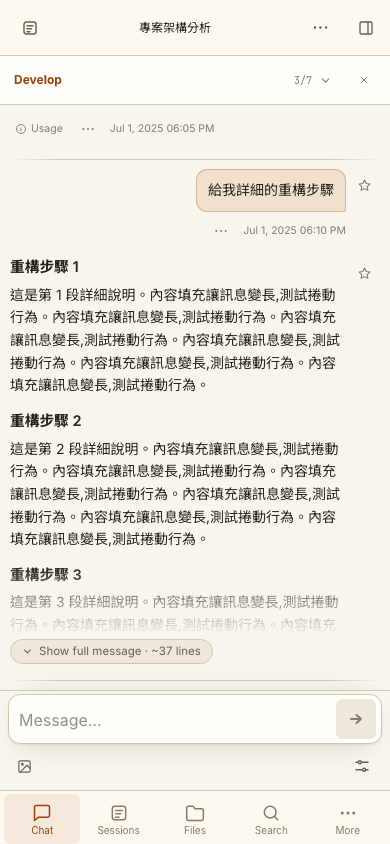
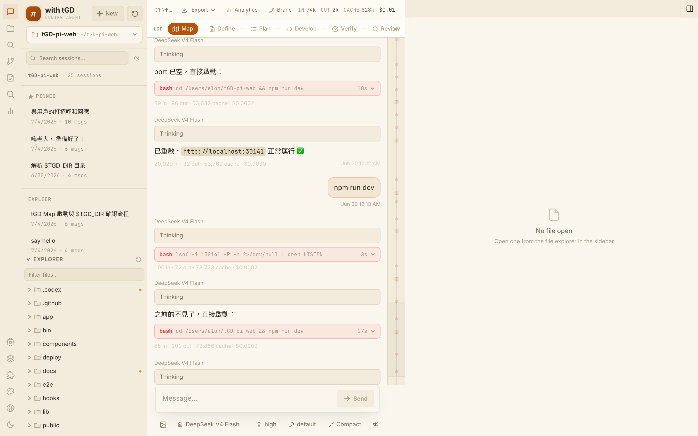
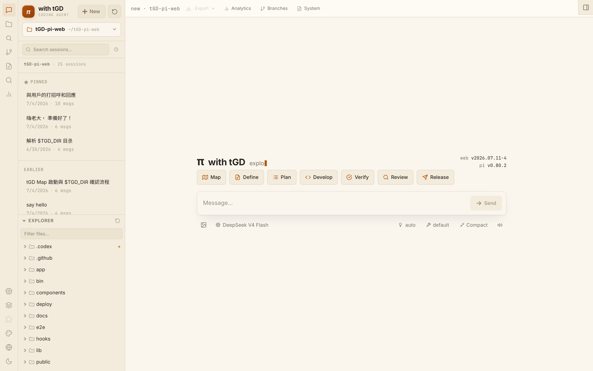
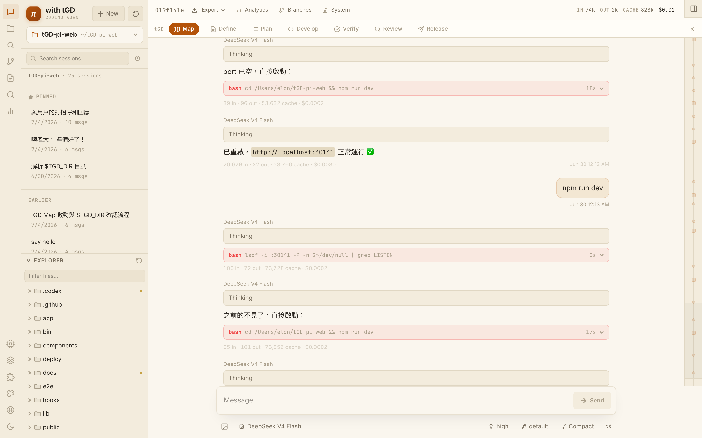
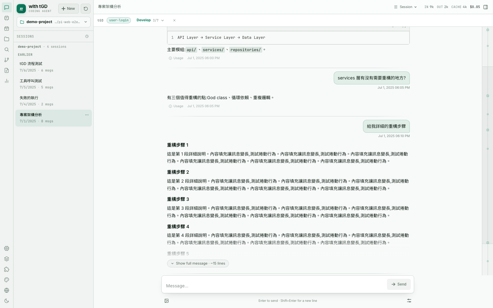
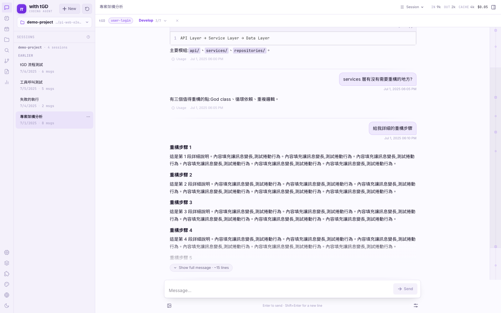
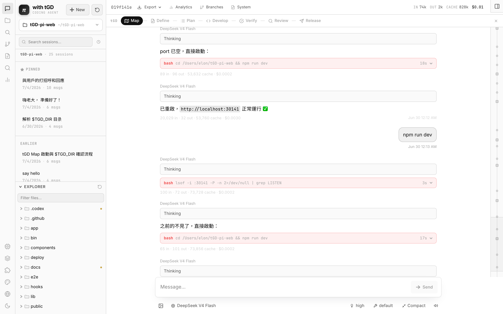
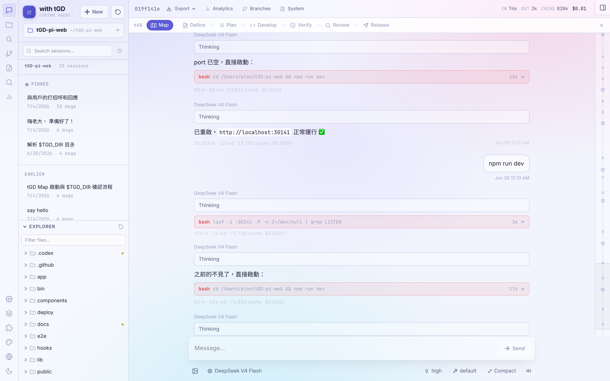

# Digital Transformation Agent

<p align="center">
  <a href="https://github.com/yhwangtw/dta/actions/workflows/ci.yml"></a>
  
  
</p>

<p align="center">
  <a href="README.md"><strong>English</strong></a> |
  <a href="README.zh-TW.md">繁體中文</a> |
  <a href="README.ja.md">日本語</a> |
  <a href="README.de.md">Deutsch</a>
</p>

<p align="center">
  <a href="https://github.com/yhwangtw/dta/releases">Releases</a> ·
  <a href="https://github.com/yhwangtw/dta/issues">Report a bug</a> ·
  <a href="https://github.com/yhwangtw/dta/issues">Request a feature</a>
</p>

**A department agent platform and human control plane for digital transformation work.**

Digital Transformation Agent (DTA) connects meeting intelligence, PDLC workflows, action tracking, department knowledge, agent runs, and human review in one traceable workspace. It is designed for both people using the DTA interface and company-level orchestrators calling bounded department capabilities.

> DTA reuses the proven Pi session/runtime infrastructure internally, but its public Agent Contract, A2A surface, product identity, and domain results are runtime-neutral.

## Product direction

DTA treats chat as one interaction method rather than the product hierarchy:

- **Meeting Intelligence** — source-backed minutes, decisions, action items, owners, and due dates. Paste material, use browser voice typing, or upload text, DOCX, audio, and video. Configured media providers produce timestamped transcripts, sampled visual evidence, and a synchronized meeting timeline.
- **PDLC Agent** — move approved decisions through requirements, design, delivery, and verification.
- **Action Tracking** — keep follow-ups, blockers, and human decisions visible across meetings.
- **Department Knowledge** — find approved decisions and artifacts without losing their context.
- **Human control plane** — review evidence, resolve exceptions, and approve publication.
- **Orchestrator entry point** — expose stable, bounded department-agent contracts to company automation.

## Who is this for?

- Department teams turning meetings and decisions into accountable follow-through.
- Digital transformation teams operating multiple specialist agents.
- Reviewers who need evidence, approval gates, version history, and execution records.
- Enterprise environments using a company orchestrator, internal model gateway, or private network.

## Quick Start

### Requirements

- Node.js 22 or newer
- npm
- A working Pi setup with `~/.pi/agent/`
- Git

This project is distributed from GitHub source and is **not published to npm**.

> [!IMPORTANT]
> DTA can read and edit files, inspect git repositories, and run shell commands in allowed workspaces. Keep it on localhost by default. For remote access, set `PIWEB_ACCESS_PASSWORD` and `PIWEB_SESSION_SECRET`, then place the service behind an authenticated private network or access proxy. The legacy environment variable names remain temporarily for compatibility. See the [deployment guide](./deploy/README.md).

Use a dedicated checkout for the supported one-step installation:

```bash
git clone https://github.com/yhwangtw/dta.git
cd dta
bash setup.sh
```

The setup script is the supported one-step source installation path. In a Git checkout it first replaces local source changes with `origin/main`, then checks Node.js and npm, installs dependencies, runs TypeScript validation, creates a production build, and can start the server. Known obsolete files from older installations are moved to `~/.dta-backups/` (override with `DTA_SETUP_BACKUP_DIR`). The Web always uses its pinned internal Pi runtime.

> [!WARNING]
> `origin/main` is the source of truth for end-user Git installations. Running `bash setup.sh` discards local commits, tracked changes, and non-ignored untracked files with `git reset --hard origin/main` and `git clean -fd`. Ignored runtime state such as `.env`, `node_modules`, and `.next` is retained.

Manual setup:

```bash
npm install
npm run build
npm start
```

Open [http://localhost:30141](http://localhost:30141).

### Update an existing checkout

```bash
bash setup.sh
```

`setup.sh` stops immediately and prints the complete TypeScript error when validation fails. It never continues into a misleading partial build.

For a deliberately offline Git checkout, skip remote synchronization explicitly:

```bash
DTA_SETUP_OFFLINE=1 bash setup.sh
```

## Architecture and company deployment

- [Agent architecture, external contracts, security boundary, and limitations](./docs/architecture.md)
- [Build-once Docker, runtime configuration, Keycloak, Vault, and Kubernetes guide](./docs/deployment.md)
- [Complete environment template](./.env.example)

The same image runs locally with local/mock adapters and in the company with Keycloak, the company LLM gateway, MinIO, and n8n. Connection information and secrets are never baked into the image.

## Interface Tour

<p align="center">
  
</p>

The mobile layout keeps the active phase, transcript, composer, model controls, and primary navigation within thumb reach while respecting device safe areas.

| Session and file workspace | Command palette |
|---|---|
|  |  |

| Dark mode | Empty state |
|---|---|
|  |  |

<details>
<summary><strong>View all five appearance skins</strong></summary>

| Editorial | Terminal | Aurora |
|---|---|---|
|  |  |  |

| Industrial | Glass |
|---|---|
|  |  |

</details>

## Key Features

### Agent chat

- Live SSE streaming with connect-before-prompt delivery.
- Prompt, steer, follow-up queue, retry, bash, and context compaction.
- Direct shell mode with `!command`; use `!!command` to omit the result from model context.
- Model and thinking-level switching during a session.
- A built-in `ask_user` tool plus Pi extension dialogs (`select`, `confirm`, `input`, and `editor`), notifications, status indicators, and text widgets; pending decisions survive reconnects.
- Pi extension session commands (`newSession`, `fork`, and `switchSession`) use the native `AgentSessionRuntime`; the Web UI follows the replacement session and reconnects SSE to it.
- Replacement failures restore the previous runtime, active-session conflicts are rejected before switching, and every open tab follows the same replacement. Extensions settings expose live runtime diagnostics.
- Import a Pi `.jsonl` through a preview-first dialog that validates its header, effective cwd, allowed roots, symlinks, size, and destination collision before switching.
- Per-run error cards, stall warnings, notifications, completion sound, and React-owned tab status.
- Editable past turns, retry from the previous branch point, independent forks, and in-session branch navigation.
- Clone the active branch into a separate session, or start an ephemeral session that intentionally leaves no JSONL after a server restart.
- Provider errors are classified (rate limit, billing, auth, outage, network, or context) with one-click fallback and an opt-in single automatic cross-provider retry.
- Project trust can be reviewed and changed from the Context inspector. Extension shortcuts can be invoked from the Extensions panel, while TUI-only custom messages receive a safe generic Web rendering.

### Attention and recovery

- A global Attention Center combines failed sessions, background agents, scheduled runs, and agents waiting for a decision; read state stays per device.
- Optional Web Push works after explicit browser enrollment. Remote enrollment requires the app access gate; localhost works without a password. Push payloads are deliberately generic and never contain prompts, repository paths, or error text.

### Scheduled agents

- The left-rail Schedule Center supports one-time, daily, weekly, and five-field cron schedules with an explicit IANA timezone.
- Choose the project, prompt, model, thinking level, tool access, missed-run policy, and whether the schedule is active; pause, resume, run now, retry, or inspect run history from one panel.
- Every run creates a normal local Pi session. If `ask_user` needs a decision, the run changes to **Waiting for input** and opens directly into that session.
- Scheduling is provided by the local Node server, with a visible heartbeat, next-wake health, missed-run accounting, and an optional independent watchdog (`npm run scheduler:watch`) that wakes the runner through its local endpoint. On restart, each schedule either catches up once or skips the missed run according to its policy, and overlapping runs are never started.

### Sessions and navigation

- Incremental, read-only session index over local Pi `.jsonl` files.
- Search, tags, pins, archive, auto-naming, HTML/Markdown export, and usage analytics.
- Conversation find, user-turn navigation, bookmarks, minimap, long-message collapse, and optional always-follow streaming.
- Project switcher with recent projects, pins, discovery, filesystem completion, and linked git worktrees.
- Reusable prompt templates for department and coding workflows.
- Local hybrid semantic search spans session history, DTA artifacts, and project source, alongside exact filename/content search.

### Files and git

- Project tree, recursive filename search, text editing, Markdown/HTML/image preview, and clickable file paths in chat.
- Git-aware badges, working-tree summary, per-file statistics, and `HEAD` versus worktree diffs.
- Tool-call presentation for `edit` and `write` operations instead of raw JSON.
- Allowed-root checks, path guards, `execFile` git calls, and response-size limits on file and git APIs.
- Snapshot restore applies a precise delta and never rewrites the user's index or `HEAD`.
- The file inspector includes symbols, definition/reference lookup, TypeScript/ESLint/related-test diagnostics, Git history, blame, and agent snapshots.

### Rendering and appearance

- GitHub Flavored Markdown, tables, task lists, KaTeX, Mermaid, and lazy-loaded syntax highlighting.
- Editorial, Terminal, Industrial, Aurora, and Glass skins, each in light and dark mode.
- Bundled Inter, JetBrains Mono, and Noto Sans TC fonts with no CDN dependency.
- Application UI languages: English and Traditional Chinese. These project documents are also available in Japanese and German.

## Keyboard Shortcuts

| Keys | Action |
|---|---|
| `⌘/Ctrl + K` | Open command palette |
| `⌘/Ctrl + P` | Open project switcher |
| `⌘/Ctrl + F` | Find in the conversation |
| `⌥ + ↑` / `⌥ + ↓` | Previous / next user turn |
| `⇧⌘M` | Open Models |
| `⌘/Ctrl + /` | Open Skills |
| `⌘/Ctrl + B` | Toggle contextual panel |
| `⌘/Ctrl + \` | Toggle right file panel |
| `↑` in an empty composer | Recall the previous message |
| `Esc` | Close the active dialog |

## Commands

| Command | Purpose |
|---|---|
| `bash setup.sh` | Replace local source with `origin/main`, validate, install, build, and optionally start production |
| `npm run dev` | Optionally start the development server on port `30141` |
| `node_modules/.bin/tsc --noEmit` | Typecheck |
| `npx eslint .` | Lint |
| `npm test` | Run Vitest unit tests |
| `npm run test:e2e` | Build and run Playwright E2E on port `30177` |
| `npm run build` | Create a production build |
| `npm run start` | Start the production server |

> [!WARNING]
> Stop `npm run dev` before `npm run build` or `npm run test:e2e`. A concurrent Next.js build corrupts the running development server's `.next/` directory.

The Playwright test runner is pinned in `package.json`. Install the Chromium test binary once, then run the suite:

```bash
npx playwright install chromium
npm run test:e2e
```

For a local container with a preinstalled Chromium:

```bash
PW_CHROMIUM_PATH=/opt/pw-browsers/chromium npm run test:e2e
```

## Configuration

| Setting | Behavior |
|---|---|
| `AGENT_DEFAULT_TYPE` | Defaults the DTA capability to `meeting` while preserving Coding Agent sessions |
| `DTA_ENABLED_AGENTS` | Enables registered server-side Agents such as `meeting-agent,pm-agent` |
| `DTA_AGENT_MANIFEST_PATH` | Mounts additional department Agent prompts, skills, and workflow allowlists without rebuilding the image |
| `DTA_DATA_DIR` | Stores DTA metadata and generic artifacts; defaults to `~/.dta` |
| `DTA_AUTH_MODE` / `KEYCLOAK_*` | Protects the external Agent Contract and A2A with Keycloak tokens |
| `LLM_BASE_URL` / `LLM_MODEL` | Registers a company LLM gateway for server-side Agent runs |
| `DTA_ARTIFACT_STORE` / `MINIO_*` | Selects local or MinIO artifact storage |
| `DTA_MEMORY_STORE` / `POSTGRES_URL` / `REDIS_URL` | Selects local, Postgres, or Redis conversation memory with configured TTL and cap |
| `DTA_WORKFLOW_PROVIDER` / `N8N_*` | Selects disabled, mock, or configured n8n workflow tools |
| `DTA_TRANSCRIPTION_PROVIDER` | `none`, development-only `mock`, or `openai-compatible` |
| `DTA_MOCK_TRANSCRIPT` | Explicit fixture used only by the mock transcription provider outside production |
| `DTA_TRANSCRIPTION_BASE_URL` / `DTA_TRANSCRIPTION_MODEL` | Company or compatible speech-to-text endpoint and model |
| `DTA_TRANSCRIPTION_RESPONSE_FORMAT` | `auto` (recommended), `json`, `verbose_json`, or `diarized_json` |
| `DTA_VISION_PROVIDER` | `none`, development-only `mock`, or `openai-compatible` keyframe analysis |
| `DTA_VISION_BASE_URL` / `DTA_VISION_MODEL` | Company or compatible multimodal endpoint and model |
| `DTA_MEDIA_PROCESSOR` | `ffmpeg` (default) or `none`; extracts video audio and keyframes |
| `DTA_MEDIA_MAX_DURATION_SECONDS` | Maximum accepted recording duration; defaults to 14,400 seconds |
| `DTA_VIDEO_MAX_KEYFRAMES` | Maximum sampled keyframes per video; defaults to 12 |
| `DTA_UPLOAD_SCANNER` | Selects no scanner or a fail-closed company HTTP malware scanner for uploads |
| `DTA_AUDIT_LOG_*` / `DTA_METRICS_*` | Configures hash-chained audit events and protected Prometheus metrics |
| `DTA_RATE_LIMIT_*` / `DTA_RETENTION_*` | Configures process-local quotas and opt-in local artifact retention |
| `PI_CODING_AGENT_DIR` | Overrides the default `~/.pi/agent` directory |
| `PIWEB_ACCESS_PASSWORD` | Enables the built-in shared-password gate for every route |
| `PIWEB_SESSION_SECRET` | Signs access cookies independently from the password; use a random 32-byte-or-longer value for remote deployments |
| `models.json` | Model/provider catalog, including custom `baseUrl` values |
| `auth.json` | Per-provider API credentials managed by Pi |
| Project picker | Selects and validates the active working directory |

Session files remain in Pi's native format:

```text
~/.pi/agent/sessions/<encoded-cwd>/<timestamp>_<uuid>.jsonl
```

### Meeting Agent foundation

Meeting Agent sessions add DTA-owned metadata and artifacts on top of the existing Pi session. Pi remains the internal reasoning/tool runtime; the product-facing identity and structured `MeetingResult` do not expose Pi internals. The Meeting runtime uses a dedicated system prompt and a bounded `publish_meeting_result` tool, then stores JSON and Markdown outputs below `DTA_DATA_DIR`.

The Meeting-first interface does not ask people to choose a repository or filesystem path. New meetings run inside a DTA-managed meeting workspace below `DTA_DATA_DIR`; the underlying cwd exists only for runtime compatibility and remains hidden from the normal product flow. Legacy Coding Agent sessions can still use their original project workspace when opened directly.

Browser speech recognition can type directly into the transcript field without saving an audio recording. Uploaded media is preserved as an artifact. FFmpeg extracts video audio and sampled keyframes; configurable transcription and vision providers produce timestamped evidence; DTA then stores a synchronized timeline for the Meeting Agent. The bundled mock providers are development/test-only and disabled in production. See [Meeting media understanding](./docs/meeting-media-pipeline.md).

Current limitation: active Pi session ownership, normalized event replay, run/review records, and Meeting/PM records remain process-local/file-backed, so this phase stays single-replica even when conversation memory uses Postgres or Redis. Company Orchestrator routes, PM Agent, configurable department Agents, A2A, Keycloak, n8n, MinIO, audit, and metrics are available now. See [the exact production limitations](./docs/architecture.md#current-production-limitations).

## Architecture

See [DTA Agent Platform Architecture](./docs/architecture.md) for the generic runtime, Meeting/PM boundaries, external Agent Contract, A2A, Keycloak, review gate, adapters, and production limitations.

## Project Structure

```text
app/api/        Agent Contract, runs/events, sessions, schedules, files, git, config
components/     layout, chat, sidebar, modals, and shared UI
hooks/          agent orchestration, streaming, scrolling, sessions, theme
lib/            RPC lifecycle, scheduling, session parsing, security, i18n, snapshots
e2e/            Playwright production-server scenarios
docs/           screenshots and project documentation
public/fonts/   bundled local fonts
```

See [`AGENTS.md`](./AGENTS.md) for the detailed architecture, invariants, and development traps.

## Offline and Air-Gapped Use

Fonts and UI assets are bundled. At runtime DTA contacts only the adapters enabled by configuration: the LLM/media gateways, Keycloak, MinIO, Postgres/Redis, n8n, and optional upload scanner.

- **Internal npm registry:** clone this repository or extract a GitHub Release source archive into a clean directory, configure npm for the internal registry, then run `bash setup.sh`. Use `npm ci && npm run build` only when an immutable CI-style install is required.
- **Portable directory:** on a networked machine with the same OS and architecture, run `npm ci && npm run build`, copy the complete directory, then run `npm run start`.
- **Internal or local model:** set a custom provider `baseUrl` in `models.json`.

`npm ci` is retained for reproducible CI and offline builds; interactive development uses `npm install`.

## FAQ

### Is this published as an npm package?

No. Install and update it from the GitHub repository or a GitHub Release source archive.

### Does it replace Pi?

No. It is a local browser interface over Pi's session files and agent runtime. Pi remains the underlying coding agent.

### Does the app upload my sessions?

The application does not include a hosted session backend. It reads local Pi files and contacts only the model/provider endpoints you configure.

### Do schedules run while DTA is stopped?

The agent execution runtime still needs the local Node server. Keep `npm start` running; for a separate wake/health process, run `npm run scheduler:watch` under launchd/systemd. After a restart, each schedule applies its configured **run once** or **skip** missed-run policy.

### Why is the Playwright browser installed separately?

The test runner is lockfile-pinned for reproducible installs, while browser binaries remain a separate environment concern. CI installs Chromium explicitly; offline/company environments can preinstall it and provide `PW_CHROMIUM_PATH`.

### Why can a compacted session still be long?

Compaction adds a summary and keeps a recent tail; it does not delete the original history from the `.jsonl` file. The UI follows Pi's active branch and compaction entry.

## Contributing

Issues and pull requests are welcome.

1. Fork the repository and create a focused branch.
2. Use `npm install` for development.
3. Run typecheck, lint, and tests.
4. Add or update tests for behavior changes.
5. Keep all four README files aligned when changing user-facing setup or features.

Improve application translations in `lib/i18n.tsx`. New skins must use semantic design tokens rather than hardcoded component colors.

## Release

After a PR passes CI and is merged, use the fast release path:

```bash
gh workflow run release.yml -f tag=vYYYY.MM.DD
```

Use the current UTC date. For another release on the same day, append a sequence suffix such as `vYYYY.MM.DD-1`; future-dated tags are rejected. One workflow updates `package.json` and `package-lock.json`, creates the release commit and annotated tag, builds and smoke-tests the self-contained `amd64`/`arm64` image, blocks High/Critical CVEs, publishes it to GHCR with SBOM/provenance attestations, and only then creates the GitHub Release. Its authenticated push does not start another CI cycle. Pushing an already-versioned `v*` tag remains supported. The workflow does **not** publish to npm.

## License

MIT — see [`LICENSE`](./LICENSE).
